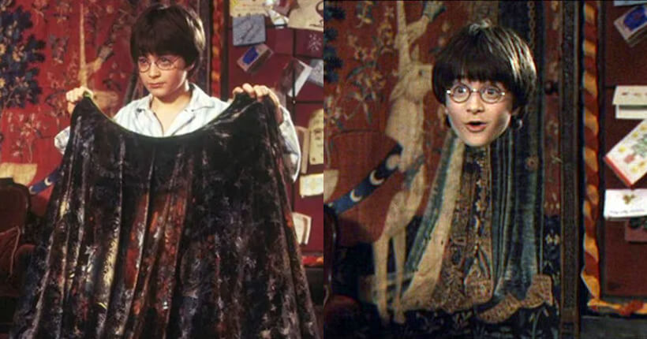

# Invisible-cloak
Computer Vision and Python

This is inspired from harry potter movie concept of Invisible Cloak where we put an object infront of us, OpenCV helps to replace that object with object background image which is captured earlier, making it invisible feeling.

